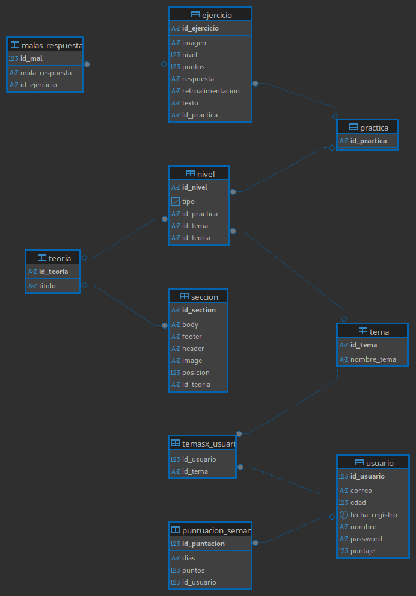
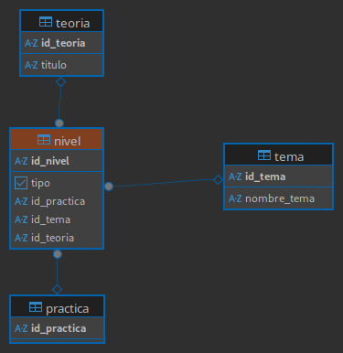
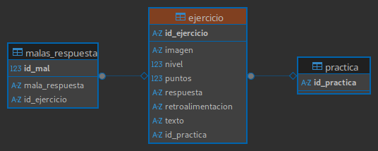
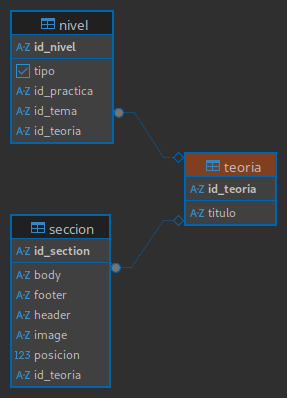
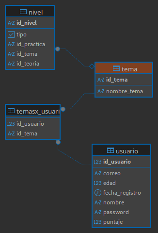
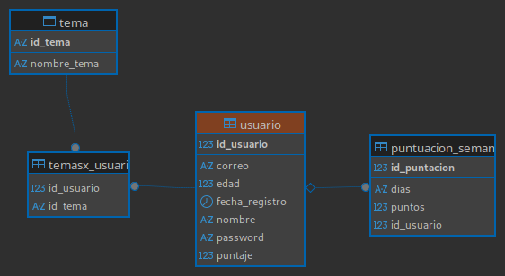

# PhysicsApp-Backend

### (ACTUALIZACION: El proyecto se queda en desarrollo, actualmente hay un error critico con los ejercicios y la compatibilidad con una app móvil, se tomarán medidas para arreglar este error. El programa aun no esta apto para ser usado)

Este repositorio contiene la API hecha en Spring Boot, en su primera versión y ya esta disponible. Por ahora solo soporta PostgreSQL y como mínimo debe ser ejecutado en Java 21.

Además, para que funcione adecuadamente, es necesario establecer variables de entorno para la conexión a la base de datos, dichas variables son las siguientes:

* DB_URL : La URL de conexión a tu base de datos
* DB_USER: El nombre de usuario ("postgres" por default)
* DB_PASS: La contraseña de tu base de datos
* El puerto por default es 80.

_Puedes usar un archivo .env para insertar estar variables_

Este servicio ayudará en las peticiones de la aplicación principal hecha en Flutter. La documentación de los endpoints aun no esta disponible, pero puedes ver el código fuente y guiarte (lo sé, puede ser poco útil, pero la universidad me quita algo de tiempo...). Muy pronto, si Dios quiere estaré subiendo la documentación de los endpoints y talvez del código.

# Inicio rápido

Primero realiza un ```git clone``` del repositorio o descargalo en un zip y descomprimelo en la carpeta de su preferencia. Luego, ábrelo en tu IDE o editor de codigo favorito y ya puedes compilarlo y probarlo. 

Si tienes **docker** en tu equipo, puedes compilarlo y ejecutarlo de dos maneras distintas

 * ### Compilarlo en un jar y ejecutarlo (util en producción)
    Abre el terminal en la direccion del proyecto y escribe el siguiente comando: 

    ```
    docker compose .
    ```

    Esto descarga y/o usará la imagen de **postgres : 18** , asi mismo utilizará el Dockerfile para crear la imagen final del proyecto. Esta imagen será ligera, ya que se utilizará la plataforma JRE para ejecutarse. 

 * ### Usando el hot reload de Spring Development kit (util para entornos de desarrollo)
    Si deseas cambiar el codigo mientras el programa esta en ejecución y deseeas usar **Docker** entonces ejecuta el siguiente comando en la direccion del proyecto.

    ```
    docker compose -f 'docker-compose-dev.yml' up -d
    ```

    Esto permitirá usar hot reload, y cada cambio que hagas se reflejará en el proyecto, ¡Incluso si esta en ejecucion!

Si deseas ver los *logs* de la aplicación puedes usar el siguiente comando.
```
docker logs {nombre/id del contenedor} -f
```
# Flujo normal para probar el funcionamiento del servicio.

## ¿Cómo se guardan los datos?

Bien, antes de empezar a probar cualquier endpoint, es necesario saber que en este proyecto se uso una base de datos relacional, y esta estructura lo podemos ver resumido por medio del siguiente diagrama: 



 - ### Nivel
 

 Un nivel contiene: o bien una **practica**, o bien un **ejercicio**. Es por ello que tanto el id_practica como el id_teoria son campos *nullables*. Además, un tema agrupa a muchos niveles en común.

 - ### Practica y Ejercicio
 

 Los ejercicios son otra parte fundamental de la app, algunos de sus atributos son:
 
 * imagen (url *opcional*)
 * nivel (dificultad del ejercicio)
 * puntos (puntos al responder correctamente)
 * retroalimentación (feedback *opcional*)

 Ademas, a la entidad *ejercicios* le relacionamos una tabla adicional de respuestas erroneas (*malas_respuestas*), esto en caso se desea usar un formato de seleccion multiple, donde podemos agregar respuestas incorrectas al ejercicio.
 
 En cuanto a la "*practica*", es mas una entidad de agrupación, siendo la relacion con "*nivel*" de (1:1).

 Finalmente para terminar esta sección, la relacion que tienen "*practica*" y "*ejercicio*" es de (1:M); y *ejercicio* y *malas_respuestas* también de (1:M)

 - ### Teoría
 

 La entidad "*teoría*" es la mas sencilla de explicar, pues esta relacionada directamente con el nivel (1:1) y contiene varias "secciones".

 La entidad "*seccion*" tiene tres partes principales (header, footer y body), pero tambien puede guardar la url de una imagen (opcional) y la posicion de la imagen (opcional, se puede usar como una referencia, en este caso lo usé para una aplicación movil)

- ### Tema 


 La entidad "*tema*" agrupa varios niveles (1:M)

- ### Usuarios y puntuacion semanal


 Aqui hacemos que cada usuario, al ser registrado, genere una "*puntuacion semanal*", esta tiene los 7 dias (Domingo-Sábado) con 0 puntos y que se irán actualizando según el dia (sobreescribiendo la puntuación). Además la relación existente entre "**usuario**" y "**tema**" es de (M:M)

## Flujo de pruebas
Si deseas levantar el proyecto y probar los endpoints, levanta el proyecto e ingresa primero al endpoint "/docs/swagger-ui/index.html". Luego puedes probar los endpoints en el siguiente orden:
   1. Usuarios
      
      - Primero crea tu usuario
      
      - Puedes ver las puntuaciones del usuario en el endpoint "*/puntuaciones/usuarios/{id}*"
   2. Ejercicios
      - Primero crea una practica en el endpoint "*/practica*" .
      
      - Luego crea un ejercicio ("*/ejercicio/crear*"), y no olvides relacionarlo con la práctica
      
         - Si agregaste malas respuestas en el paso anterior, ¡puedes probar los endpoints de malas respuestas!
   3. Teoria
      
      - Crea una teoria en el endpoint "*/teoria/crear*".
      
      - Crea una o varias secciones con el endpoint "*/seccion/crear*", y no te olvides de relacionarlo con la teoria creada en el paso anterior.

  4.  Niveles
      
      - Primero crea un tema en el endpoint "*/tema/crear*".
      
      - Cuando ya tengas creada una practica o una teoría, ya puedes crear un nivel. Para ello, relaciona el id de uno de los dos e indica el tipo de nivel (false: practica, true: teoria). 

        > No olvides relacionar el nivel con el tema creado en el primer paso